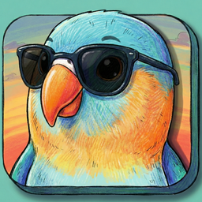

<div align="center">
  
  <h1>LowKeet</h1>
  <p>Privacy-first voice-to-text for macOS - 100% offline transcription</p>

  
  [](https://www.gnu.org/licenses/gpl-3.0)
</div>

---

## Overview

**LowKeet** is a fully open-source, privacy-focused macOS application that transcribes speech to text instantly using local AI models.

## Features

- 🎙️ **Accurate Transcription**: Local AI models (Whisper & Parakeet) that transcribe speech to text with high accuracy
- 🔒 **Privacy First**: 100% offline processing - your data never leaves your device
- 🎯 **Global Shortcuts**: Configurable keyboard shortcuts for quick recording and push-to-talk functionality
- 📝 **Personal Dictionary**: Train the AI with custom words, industry terms, and smart text replacements
- 🔄 **Smart Modes**: Multiple transcription modes optimized for different writing styles and contexts
- 🎨 **Customizable Interface**: Choose between Notch Recorder and Mini Recorder styles
- ⚙️ **Audio Control**: System audio muting during recording, custom feedback sounds
- 💾 **Data Management**: Import/export settings, automatic transcript cleanup options

## Getting Started

### Prerequisites

- macOS 14.0 or later
- Xcode 15.0 or later
- ~3GB of disk space (for models and build)

### Quick Start

> 💡 TIP: Go to releases for the easiest install experience.

1. **Clone the repository**

   ```bash
   git clone https://github.com/[YOUR_USERNAME]/LowKeet.git
   cd LowKeet
   ```

2. **Run the automated dependency installer**

```bash
./scripts/install-dependencies.sh
# This downloads models-v1.0 and whisper-framework-v1.0 automatically
```

3. **Open in Xcode**

   ```bash
   open LowKeet.xcodeproj
   ```

4. **Configure Code Signing**

   - Select the LowKeet project in the navigator
   - Go to "Signing & Capabilities" tab
   - Select your development team from the dropdown
   - Xcode will automatically manage provisioning

5. **Build and Run**

   - Press `⌘+B` to build
   - Press `⌘+R` to run

## Project Structure
```
LowKeet/
├── LowKeet/                    # Main source code
│   ├── Models/                 # Data models
│   ├── Views/                  # SwiftUI views
│   │   ├── Settings/           # Settings screens
│   │   ├── Recorder/           # Recording UI
│   │   └── Components/         # Reusable components
│   ├── Services/               # Business logic & services
│   ├── Whisper/                # Whisper integration
│   └── Resources/              # Assets and models
│       └── BundledModels/      # AI models (1.6GB)
├── whisper.xcframework/        # Whisper C++ framework
├── BundledModels/              # Additional model files
└── LowKeet.xcodeproj/          # Xcode project
```

## License

This project is licensed under the **GNU General Public License v3.0** - see the [LICENSE](LICENSE) file for details.

This means you can:

- ✅ Use the software for any purpose
- ✅ Study and modify the source code
- ✅ Distribute copies
- ✅ Distribute modified versions

Under the conditions that:

- ⚠️ You disclose the source code
- ⚠️ You license modifications under GPL v3.0
- ⚠️ You state changes made to the code
- ⚠️ You include the original license and copyright

## Acknowledgments

### Originally Based On

**[VoiceInk](https://github.com/Beingpax/VoiceInk)** by Pax - LowKeet is adapted for fully offline, open-source distribution.

### Core Technology

- [whisper.cpp](https://github.com/ggerganov/whisper.cpp) - High-performance Whisper model inference
- [FluidAudio](https://github.com/FluidInference/FluidAudio) - Parakeet model implementation
- [NVIDIA Parakeet](https://github.com/NVIDIA/NeMo) - Speech recognition models

### Essential Dependencies

- [KeyboardShortcuts](https://github.com/sindresorhus/KeyboardShortcuts) - User-customizable keyboard shortcuts
- [LaunchAtLogin](https://github.com/sindresorhus/LaunchAtLogin) - Launch at login functionality
- [MediaRemoteAdapter](https://github.com/ejbills/mediaremote-adapter) - Media playback control during recording
- [Zip](https://github.com/marmelroy/Zip) - File compression and decompression
- [SelectedTextKit](https://github.com/tisfeng/SelectedTextKit) - Modern macOS library for getting selected text
- [Swift Atomics](https://github.com/apple/swift-atomics) - Thread-safe concurrent programming

---

**LowKeet** - Privacy-first voice transcription for macOS
Open source • Offline • Free
